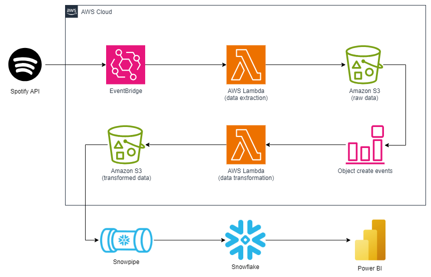
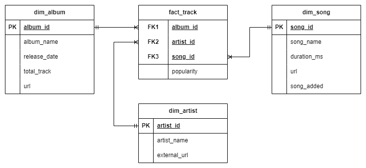

# spotify-data-pipeline

## Dataset Used
Spotify Web API enables the creation of applications that can interact with Spotify's streaming service to retrieve content metadata. There is playlist track data consisting of album, artist, and song information in the JSON format.

## Services
- EventBridge: a serverless service that uses events to connect application components together, making it easier for you to build scalable event-driven applications.
- AWS Lambda: an event-driven, serverless computing platform provided by Amazon as a part of Amazon Web Services.
- Amazon S3: Simple Storage Service is a service offered by Amazon Web Services that provides object storage through a web service interface.
- Snowflake: a cloud-based data warehousing solution that provides a highly scalable and flexible platform for storing and processing data.
- Power BI: an interactive data visualization software product developed by Microsoft with a primary focus on business intelligence.

## Architecture Diagram
\

## Dimensional Modelling
\

## Analysis
\
